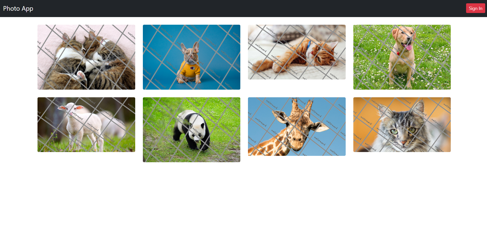
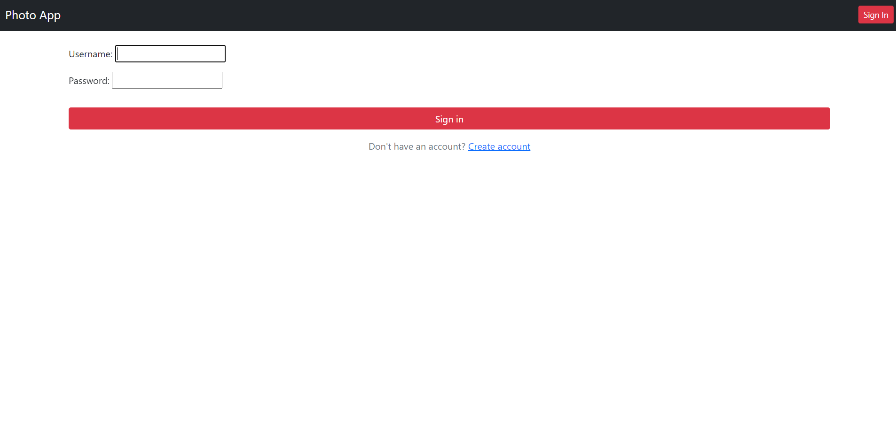
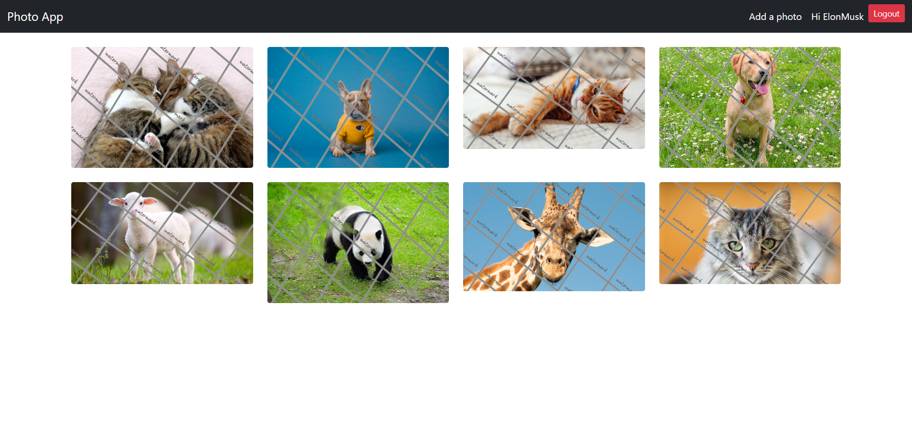
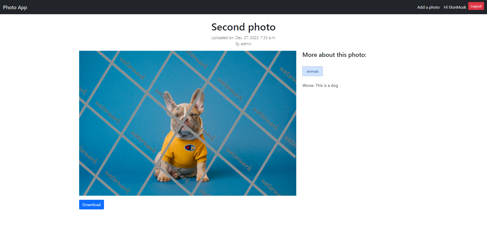
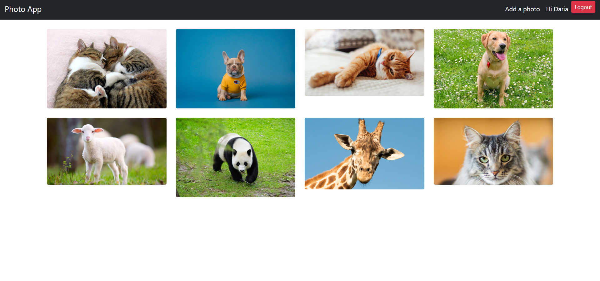
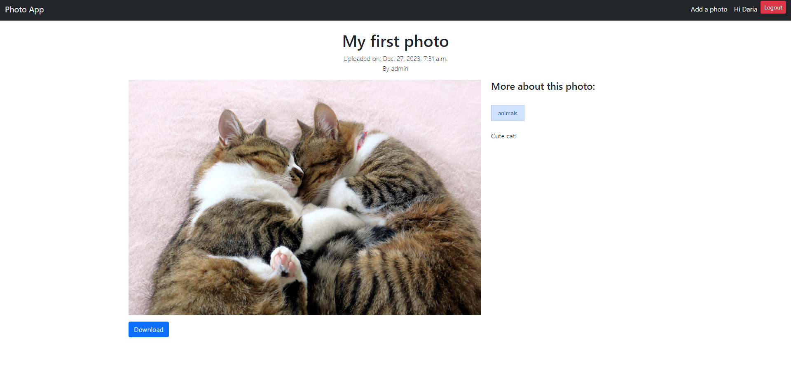

# Photostock
## This application is used to share photos.

* Unregistered users can only view a list of photos with a watermark applied. When trying to open a photo in full scale, the user will be redirected to the registration page.

* Registered users can view both the list of photos and each photo individually in close-up. However, until certain conditions are met, photos are displayed with a watermark.

* Users who have uploaded more than three photos get access to the images without a watermark.

